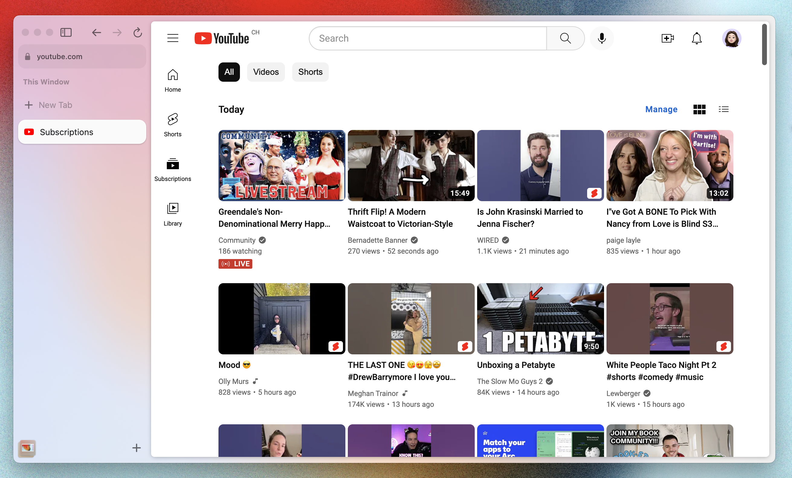

# YouTube Subscriptions Filters

This is a boost for Arc that allows you to filter your YouTube subscriptions by videos or shorts or all.

## Installation

1. Open https://www.youtube.com
2. Click the "+" button and select "New Boost"
3. Select "Custom", then "A specific website", and "Create boost"
4. Replace the contents of `content.js` and `style.css` by the ones in this git
5. Enjoy a custom filtered subscriptions list !